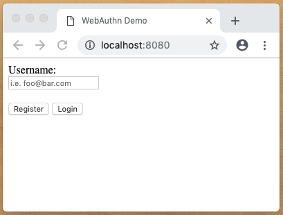
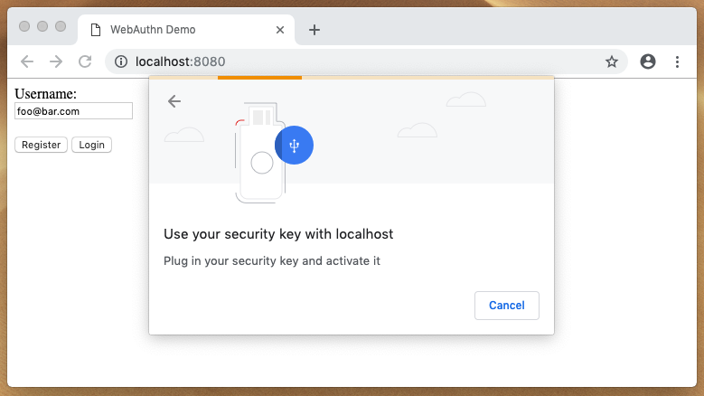

# WebAuthn Basic Client/Server Example (go)

This library implements a simple, basic WebAuthn client and server based on [duo's WebAuthn implementation](https://github.com/duo-labs/webauthn). The code pulls inspiration from [duo's WebAuthn example implementation](https://github.com/duo-labs/webauthn.io). This example is NOT meant to be used in production, but rather as an introduction to WebAuthn as well as a more quick-and-dirty, stripped down version of [webauthn.io](https://webauthn.io/).

## Quickstart

### Download

Download the project (i.e. via `git clone` or `go get`) and navigate to the project's root directory. 

### Start

Start the server by compiling and running the code. It should look something like this:

```bash
$ go run .
```

### Test

#### Spin Up

Fire up a web browser and go to [localhost:8080](http://localhost:8080). You should see something like this:



#### Register

To test that the demo is working properly, enter an email like `foo@bar.com` and press the `Register` button. You should be prompted to gesture (i.e. tap, scan finger) to some authenticator. It should look something like this:



Upon successful registration, you'll see an alert saying you successfully registered, similar to this:


#### Login

Press the login button and follow the instructions. The login process is identical (user side) to the registration process.